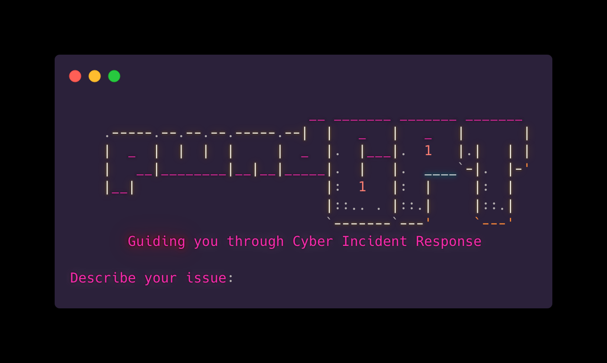

# pwnd-GPT

A CLI tool built with Rust that guides users through cybersecurity incident response using GPT-3.5-turbo powered assistance. Simply describe the incident, and recieve an incident response plan along with terminal commands and steps enabling faster incident response campaigns and active defence.

<p align="center">
  
</p>

## Table of Contents

- [Features](#features)
- [Installation](#installation)
- [Usage](#usage)
- [Contributing](#contributing)
- [License](#license)

## Features

- Get step-by-step guidance on handling cybersecurity incidents.
- Interacts with OpenAI GPT-3.5 for advanced assistance.
- Identify and clear threats using command line tooling.

*Note: Always check results for accuracy. GPT-4 may be used in due time to improve accuracy.*

## Installation

1. Ensure you have Rust and Cargo installed on your system. If not, follow the [official installation guide](https://www.rust-lang.org/tools/install).

2. Clone the repository:

```bash
git clone https://github.com/0xKoda/pwnd-GPT.git
```

3. Change to the project directory:

```
cd pwnd-GPT
```

4. Build the project

```
cargo build --release
```

5. Add compiled binary to path

```
export PATH=$PATH:/path/to/pwnd-GPT/target/release
```

## Usage
1. Set the OPENAI_API_KEY environment variable with your OpenAI API key:

```
export OPENAI_API_KEY="your-api-key-here"
```
2. Run the CLI tool:

```
pwnd-GPT
```

Note: Input the issue you are having, if it is a malware infection, input "malware infection".
Be sure to input any tools you might have installed to assist with the incident response. 
Chat GPT will guide you through the process. 

## Contributing
Contributions are welcome! Please feel free to submit a pull request or open an issue on the project's GitHub repository.

## License
This project is licensed under the MIT License.